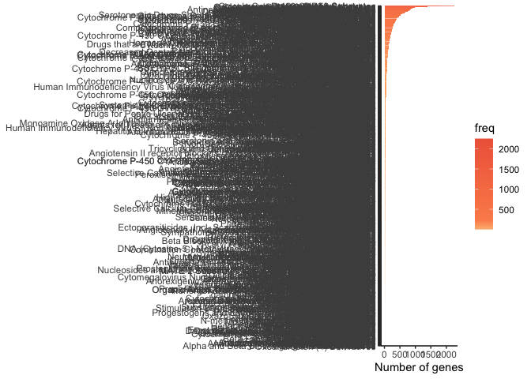
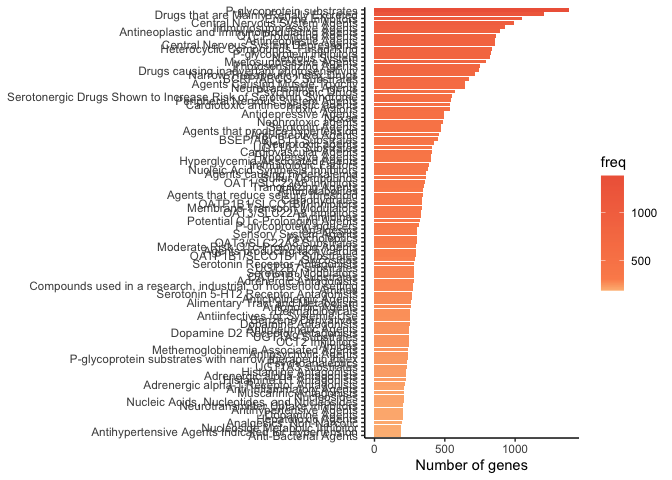
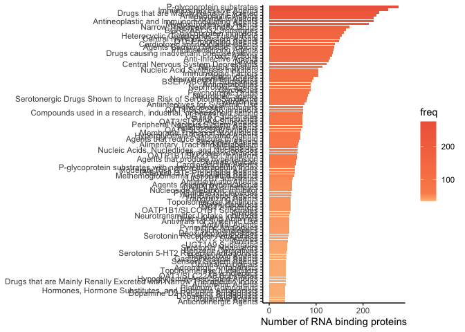

Drug Repurposing and Visualization
================
Wael Kamel
12/05/2021

## Mining both drug-gene interactions and Drug bank for potential compounds for your "gene of interest´ list

``` r
#load libraries 
library(scales)
library(tidyverse)
```

``` r
# Note dbdataset is only avaiable from Github https://github.com/interstellar-Consultation-Services/dbdataset
library(dbdataset)
```

## data clean up and integration

``` r
# download the updated list of drug-gene interactions from https://www.dgidb.org/
drugs_interactions<-  as.data.frame(read.delim("DGIdb_Interactions.txt", sep="\t",header=TRUE,  fill = TRUE ))


# to select the mode of action of the drug, you need to look at "interaction_types"
unique(drugs_interactions$interaction_types)
```

    ##  [1] inhibitor                                                      
    ##  [3] agonist                         allosteric modulator           
    ##  [5] modulator                       antagonist                     
    ##  [7] blocker                         activator                      
    ##  [9] antibody                        positive modulator             
    ## [11] vaccine                         inverse agonist                
    ## [13] partial agonist                 agonist,antagonist             
    ## [15] negative modulator              antisense oligonucleotide      
    ## [17] antagonist,allosteric modulator inducer                        
    ## [19] blocker,activator               agonist,allosteric modulator   
    ## [21] antagonist,activator            inhibitory allosteric modulator
    ## [23] suppressor                      antagonist,inhibitor           
    ## [25] blocker,inhibitor              
    ## 25 Levels:  activator agonist ... vaccine

``` r
# if you interested in inhibitory action then you can select the corresponding mode of action
Inhibitory= c("inhibitor", "blocker", "blocker,inhibitor", "antagonist,inhibitor", "inhibitory allosteric modulator suppressor")

# filter only durgs with inhibitory actions, please Note this doesnot mean that the drug will direct mode of action

drugs_interactions_Inhibitory = subset(drugs_interactions, interaction_types %in%Inhibitory )

# How many unique compounds with Inhibitory action 

length(unique(drugs_interactions_Inhibitory$drug_claim_primary_name))
```

    ## [1] 3772

``` r
# extracting Names and Classification of the drugs from drugbank

Classifications_Drug = dbdataset::Classifications_Drug
Categories_Drug= dbdataset::Categories_Drug

Categories_Drug_Classifications__Drugs_ID= merge(Categories_Drug, Classifications_Drug,  by.x = "parent_key", by.y = "drugbank_id" )
# Key to all drug names and drugId

Products_Drug= dbdataset::Products_Drug

Products_Drug$name <- stringr::str_to_lower(Products_Drug$name)

# Now we can combine the informatio from drugbank and dgidb 
Products_Drug$name <- stringr::str_to_lower(Products_Drug$name)
drugs_interactions_Inhibitory$drug_claim_primary_name <- stringr::str_to_lower(drugs_interactions_Inhibitory$drug_claim_primary_name)

Products_Drugs_Interactions= merge(Products_Drug, drugs_interactions,  by.x ="name" , by.y = "drug_claim_primary_name")

# subset only gene name and corresponding durgs


drugbank_id_target_gene_name = select(Products_Drugs_Interactions, 19, 20)
drugbank_id_target_gene_name= unique(drugbank_id_target_gene_name)

# Now lets have alook about drug classifcation 

Classifications_Drug_drugbank_id_target_gene_name = merge(Classifications_Drug, drugbank_id_target_gene_name, 
                                                          by.x = "drugbank_id", by.y = "parent_key" )
Categories_Drug_drugbank_id_target_gene_name = merge(Categories_Drug, drugbank_id_target_gene_name, 
                                                          by.x = "parent_key", by.y = "parent_key" )
count_Categories_Drug_drugbank_id_target_gene_name<- plyr::count(Categories_Drug_drugbank_id_target_gene_name,  c("category"))
```

## 

``` r
# All drug classeses 
ggplot(count_Categories_Drug_drugbank_id_target_gene_name, aes(x= reorder(category, freq), fill=freq, y= freq)) +
  geom_col( )+
  theme_classic()+
  scale_fill_gradientn(colours = c("#fdbb84", "#fc8d59", "#ef6548"), 
                       values = rescale(c(0,10,100)))+
  coord_flip()+
    ylab(label = "Number of genes")+
  theme_classic()+
  theme(axis.title.y = element_blank())
```



``` r
# remove very rdundant cytochrome inhibitors and showing only top 100 classes
count_Categories_subset = subset(count_Categories_Drug_drugbank_id_target_gene_name,  !(grepl("Cytochrome", count_Categories_Drug_drugbank_id_target_gene_name$category)))
count_Categories_subset = top_n(count_Categories_subset, 100, freq)

ggplot(count_Categories_subset, aes(x= reorder(category, freq), fill=freq, y= freq)) +
  geom_col( )+
  theme_classic()+
  scale_fill_gradientn(colours = c("#fdbb84", "#fc8d59", "#ef6548"), 
                       values = rescale(c(0,10,100)))+
  coord_flip()+
  theme_classic()+
    ylab(label = "Number of genes")+
  theme(axis.title.y = element_blank())
```



``` r
# subset by gene list, for example RNA binding proteins

RBP<-  as.data.frame(read.delim("RBPs.txt", sep="\t",header=TRUE,  fill = TRUE ))

RBP_Categories_Drug_drugbank_id_target_gene_name = subset(Categories_Drug_drugbank_id_target_gene_name,gene_name %in% RBP$All_RBPs_thomas )

count_RBP_Categories_Drug_drugbank_id_target_gene_name<- plyr::count(RBP_Categories_Drug_drugbank_id_target_gene_name,  c("category"))
# remove very rdundant cytochrome inhibitors
count_RBP_Categories_subset = subset(count_RBP_Categories_Drug_drugbank_id_target_gene_name,  !(grepl("Cytochrome", count_RBP_Categories_Drug_drugbank_id_target_gene_name$category)))
count_RBP_Categories_subset = top_n(count_RBP_Categories_subset, 100, freq)

ggplot(count_RBP_Categories_subset, aes(x= reorder(category, freq), fill=freq, y= freq)) +
  geom_col( )+
  theme_classic()+
  scale_fill_gradientn(colours = c("#fdbb84", "#fc8d59", "#ef6548"), 
                       values = rescale(c(0,10,100)))+
  coord_flip()+
  ylab(label = "Number of RNA binding proteins")+
  theme_classic()+
  theme(axis.title.y = element_blank())
```


